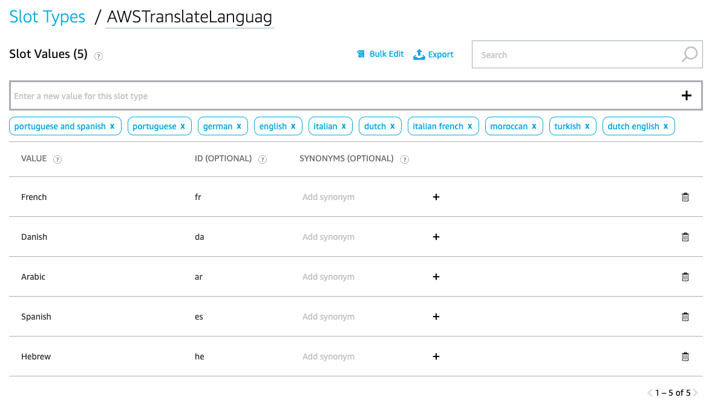

# Part 3 - Add SMS Translation (Advanced)

In this part we are going to use the basic skill we have created in [Part 1 - Create your first skill](BuildYourFirstSkill.md) and [Part 2 - SMS dictation skill](SMSDictationSkill.md). If you did not complete these parts, please do it now and come back to part 3 later.

## Add translation to your skill
We would like users to be able to ask Alexa to translate the SMS (originally in English) to one of the languages supported by [Amazon Translate](https://aws.amazon.com/translate/). For a list of supported languages please visit [This page](https://docs.aws.amazon.com/translate/latest/dg/how-it-works.html#how-it-works-language-codes).

### Add translation slot
We need to inform our skill and the Lambda backend code, that we would like to translate the SMS and to which language. To be able to do that, we will add a new slot, named ```translate```, to store the translation target language. Before being able to add the new slot, we need to figure out the slot type. We can define this slot with the built-in slot type of ```AMAZON.Language```, but this will allow us to provide any language, unrelated to Amazon Translate's supported languages. To limit our languages list, we should add a new custom Slot Type (let's call it ```AWSTranslateLanguages```) and define the available languages and their IDs, based on the link above.
Your custom slot type should look something like that:

Now you can go and define your ```translate``` slot and assign the new type to it. Edit the slot and add speech prompts and user utterances to get the translation info from your user.

This is the only change you need to make on the Alexa Skill side. The rest of the logic will be handled by our Lambda function.

### Extending your Lambda with Amazon Translate
We would like you to create the Lambda integration on your own by adding the needed code to your [```lambda_function.py```](./sendSMSSkillLambda/lambda_function.py).
The basic idea is to use the [Boto 3 documentation](https://boto3.amazonaws.com/v1/documentation/api/latest/reference/services/translate.html) for Amazon Translate to add translation capabilities to your code.

In case you run into issues, don't worry, we have a full working solution "hidden" in this git repository. You can find it here - [```lambda_function.py.solution```](./sendSMSSkillLambda/lambda_function.py.solution).
