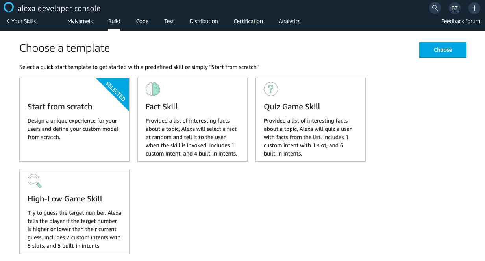

# Part 1 - Build your first skill
In this part, you will setup your Alexa Developer account and build a basic Alexa Skill that can reply to basic greeting.

Please follow the next step-by-step instructions to complete this section.

## Open an Amazon Alexa Developer Account
Open https://developer.amazon.com and follow the instruction to open a new account.

## Create your first skill
Go to the main skills page and click the ```Create Skill``` button.

In the ```Create a new skill``` page give your skill a name, set your default language to English (US) and selecy ```Custom``` as the model to add to your skill.


On the next page you will be asked to Chose a template - select ```Start from scratch```.



### Welcome to your skill Build page!
This is the main page we will use to build our skill


### Basic Skill Definitions
#### Set Invocation name
Every skill requires an Invocation word - this should be a word that will trigger this specific skill. To trigger your skill you will have to say ```"Alexa, open/ask/begin/etc. [Invocation Name]..."``` to activate your skill.

Make sure you follow the Invocation name requirements.
After setting the name. don't forget to click ```Save Model``` to save your changes.

#### Define your Intent
Intents are actions your skill can perform. Every skill comes with some default required intents such as FallbackIntent, CancelIntent, HelpIntent, StopIntent and NavigateHomeIntent.

We will add our first basic intent that should get out name as an input and store it for future use.

Click on ```Add Intent```, name your custom intent ```GetMyName``` and then click ```Create custom intent```.

#### Sample Utterances
Alexa needs some sample utterances to trigger a specific intent in your skill. Provide some samples that are likely to be used by your customers to activate this intent. For example you can use ```Let me tell you my name``` or anything similar. You can (and should) have more than one sample utterance to cover different scenarios.

#### Slots
Slots are variables your skill needs to store data and perform actions. Each intent has it's own slots and they are save for the duration of the session.

For now, we would like to store your name in one of our slots (we will use it later on). Create a new slot with the name ```myName```, click the ```+``` sign to add it and define the slot type as ```AMAZON.FirstName```. A slot type defines how data in the slot is recognized and handled, such as a list of possible values to expect in the slot.

To add additional properties to the slot click on ```Edit Dialod``` next to the slot. On this screen, you can set properties such as validation and define required slots. In our case, this slot is required so we should turn on ```Slot Filling``` and define speech prompts that will be used by Alexa to ask the user to fill the slot. You can use multiple prompts. Don't forget to click the ```+``` sign to add it.

In addition, you should add ```user utterances``` that let Alexa know what might a user say as a response to the slot filling question. Those utterances should include the slot in curly brackets {}.

#### Use slots in Utterances
To make the conversation more fluent, you should provide some of the main, intent level, utterances with slot placeholders. In our case, it is very common for somebody to tell our intent that ```My name is {myName}``` so we should add this (and other use cases) to our utterances.

### Save, Build and Profile
At this stage your intent page should look something like that:

Save your model (if you did not already) and run your first Build.

The Build process will take all your skill definition and create the needed components to run it, including training of the NLP model needed for your skill.

When the build is done, you should be able to test your intents using the ```Utterances Profiler``` button at the top right of your screen.

Test your name intent and make sure you can perform a dialog with the skill, that will eventually save your name in the ```myName``` slot.

Ready to move on? [Click here - Part 2 >>](EmailDictationSkill.md)
