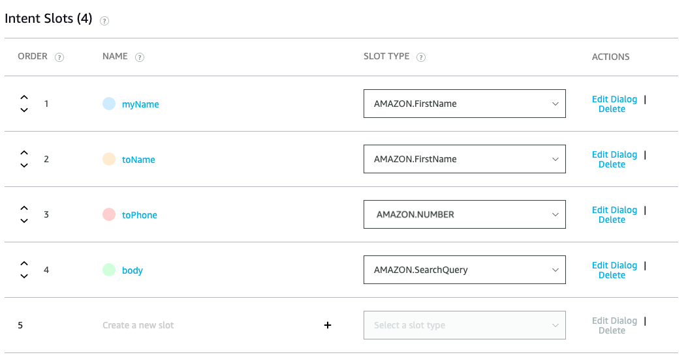

# Part 2 - SMS dictation skill

For this part we are going to use the basic skill we have created in [Part 1 - Create your first skill](BuildYourFirstSkill.md). If you did not complete this part, please do it now and come back to part 2 later.

## Extending our current skills
As mentioned before, we will use the exiting skill and intents you should have from step 1.

For SMS dictation, we will need to extend the basic ```GetMyName``` intent to deal with multiple Utterances, Slots and additional components (such as our backend endpoint to process the SMS).

### Rename your intent
As a first step, let's rename the intent to ```SendSMS```. Click on the intent name and change it. Save your model to apply changes.

### Change Sample Utterances
Our original intent was all about the user name. We need to change our current intent to support session initiations related to SMS sending.
Update your ```Sample Utterances``` to support new dialogs.
You should add utterances such as:
- I would like to send an SMS
- Send SMS
- Send message
- Etc.

### Adding additional slots
Our SMS skill will need several slots to send our message:
- Sender name - We will use the already available ```myName``` slot.
- Recipient name (```toName```)
- Recipient phone number (```toPhone```)
- SMS body (```body```)

Go and add the missing slots and define slot types, prompts and user utterances.

At the end of the process you should have something like the next screenshot in your Intent Slots list:


The ```AMAZON.SearchQuery``` slot type is used for open text inputs in our skill.

At this stage you can use the new slots to update your main ```Sample Utterances```to use those slots in customers request. You should add utterances such as 'I would like to send an SMS to ```{toName}```'

### Intent Confirmation
Since we want to make sure Alexa got the right SMS details before sending it, we will use ```Intent Confirmation``` to verify the input before sending it out.

To do that, turn on ```Intent Confirmation``` and define a prompt, using the different slots that Alexa should say before sending out the SMS.

## Save, Build and Profile
Save your model (if you did not already) and run your Build.

Test your ```SendSMS``` intent and make sure you can perform a dialog with the skill until you get the Intent confirmation.

## AWS Lambda integration
If we want any Alexa skill to perform actions, we need to integrate it with some kind of a backend for fulfillment.

### Define Lambda function

#### Setup Alexa Skill as a trigger

### Set Alexa Skill endpoint

## Test it all together

Ready to move on? [Click here - Part 3 >>](AddTranslation.md)
